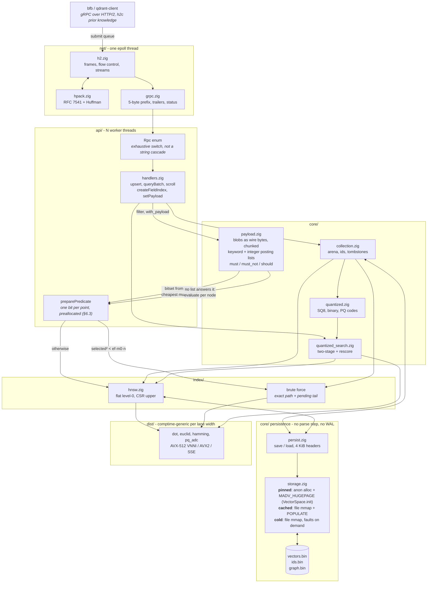
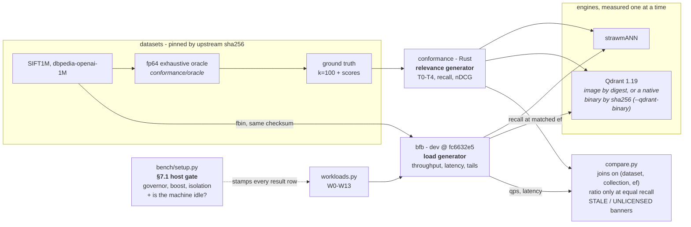

<p align="center">
  <picture>
    <source media="(prefers-color-scheme: dark)" srcset="assets/strawmann-logo-dark.svg">
    
  </picture>
</p>

<h1 align="center">strawm<em>ANN</em></h1>

<p align="center">
  <strong>A deliberately unfair strawman for approximate nearest neighbour search</strong><br>
  A Qdrant-wire-compatible vector engine in Zig, built as a performance oracle: no compatibility debt, no distribution, no product.
</p>

<p align="center">
  <a href="https://ziglang.org/download/"></a>
  <a href="docs/comparison-sift1m.md"></a>
  <a href="docs/comparison-sift1m.md"></a>
  
  
</p>

<p align="center">
  <a href="#quick-start">Quick start</a> ·
  <a href="#how-it-works">How it works</a> ·
  <a href="#the-comparison">Comparison</a> ·
  <a href="#what-it-does-not-protect-you-from">Unsafe by design</a> ·
  <a href="docs/findings.md">Findings</a> ·
  <a href="docs/validation.md">Validation status</a>
</p>

<!-- BEGIN compare-table (generated by bench/harness/compare.py --write-readme) -->
```
                            strawmann      qdrant 1.19      ratio
  search, one at a time         1,748            1,936      0.90x
  saturating                   23,477           10,501      2.24x
  mixed read/write              1,817            1,870          -
  exact                           191              145      1.31x
                                                       queries/second

  sift1m, d=128, euclid — these ratios are this dimension's. Also measured: dbpedia-openai-100K-1536-angular

  at equal recall (§7.4's comparison, not equal ef): 2.17x at recall 0.9877, falling to 1.69x at 0.9984, over 8 anchors

  saturating: [2.24x is 1.57x less work per query x 1.37x cores busy during the row (7.53 against 5.48) x 1.04x clock: the middle term is occupancy, not search speed]
  mixed read/write: [strawmann: search covered 45% of the append; append 3,300 points/s] [qdrant: search covered 44% of the append; append 3,300 points/s] [search-during-write; no recall join]
  exact: [1.31x is 0.77x less work per query x 1.70x cores busy during the row (6.94 against 4.09) x 1.00x clock: the middle term is occupancy, not search speed]
```
<!-- END compare-table -->

<p align="center">
  <em>SIFT1M, both engines alone on one host, <code>as-deployed</code> profile,
  median of three passes alternated A/B/A/B. The gate verdict, conformance tier
  and hashes are under the full table in
  <a href="docs/comparison-sift1m.md">docs/comparison-sift1m.md</a>; the
  d=1536 tier is in
  <a href="docs/comparison-dbpedia-openai-1m.md">docs/comparison-dbpedia-openai-1m.md</a>.
  Each run is one self-contained HTML page at
  <a href="https://agourlay.github.io/strawmann/reports/">agourlay.github.io/strawmann/reports/</a>.
  One machine, one day per run.</em>
</p>

The deliverable is the cost model and the ratio *measured / modelled* for each
of its terms: [`docs/cost-model.md`](docs/cost-model.md) and
[`docs/isa-matrix.md`](docs/isa-matrix.md). The useful part is where the model
was wrong.

Binary, package, flags and env vars are all `strawmann`.

Disclosures. The author works at Qdrant, on the engine being measured. Nothing
here is a Qdrant position and nobody at Qdrant has reviewed it. Most of the
harness, analysis and documents were written with Claude;
[`bench/harness/nightrun.py`](bench/harness/nightrun.py) runs a headless
`claude -p` for each night's write-up. The numbers come from the gate and the
load generator either way.

The tree was squashed to one commit. Report pages and `docs/` cite hashes from
a history this repository no longer carries; they date a number and do not
resolve here.

---

## Quick start

Zig **0.16.0**, pinned in `build.zig.zon` and installed exactly by CI.

```sh
scripts/doctor.py                    # host setup, what it can measure, where it writes
scripts/check.py                     # the gate: format, lint, tests, both languages
zig build -Doptimize=ReleaseFast     # the only build numbers are quoted from
./zig-out/bin/strawmann --port 6334  # the banner prints build mode and ISA
```

Server sizing: `--io-threads`, `--workers`, `--connections` per I/O thread,
`--streams` per connection, `--capacity` per collection. `strawmann --help` has
the rest. The gate and the dataset fetcher are stdlib Python; the analysis
tooling is a uv project under `bench/`.

The benchmark is one command:

```sh
bench/harness/fullrun.py --server-cpus 4-11 --client-cpus 0-3 --reps 3 --perf
bench/harness/smoke-test.sh          # sift1m, one pass per engine, ~35 min
```

`fullrun.py` runs the §7.1 gate, builds ReleaseFast, runs W0-W13 against
strawmANN on the server cores with the load generator on the client cores,
sweeps recall while the collections still match the ground truth, runs the
mutating rows last, repeats all of it against Qdrant on the same cores, runs
the §8 differ, then renders the report and regenerates the tables in this file.

- `--reps 3` alternates the arms A/B/A/B and folds a noise floor. One pass
  renders a page and publishes nothing.
- `--perf` attaches hardware counters. Needs a native Qdrant
  (`--qdrant-binary`) and costs about 4% of throughput.
- `--dataset` picks the corpus for the rows, the sweeps and the differ. Two
  datasets are never ratioed.
- `--segment-policy` and `--oversampling-policy` each name one of two Qdrant
  experiments. Runs under different policies are never ratioed either.
- `--skip`, `--lax`, `--placement`, `--wait-for-gate`: see `--help`.

The rows are in [`docs/workloads.md`](docs/workloads.md).
`smoke-test.sh` is what to run after a change: one pass per engine into
non-published labels, differ included.

Nothing is written outside the checkout except under one cache root, defined
in `bench/harness/paths.py`:

```sh
$STRAWMANN_CACHE          # default ${XDG_CACHE_HOME:-~/.cache}/strawmann
  datasets/               # $STRAWMANN_DATA: ~21 GB with both tiers converted
  qdrant-storage/         # $QDRANT_STORAGE
bench/results/            # in the checkout, gitignored
```

Precedence, highest first: `--data-dir`, the env vars,
`${XDG_CONFIG_HOME:-~/.config}/strawmann/config.toml`, the defaults above.
`scripts/doctor.py` prints where each root came from. `--data-dir` exports
`$STRAWMANN_DATA` to every tool it spawns, so datasets can be shared with bfb
and vector-db-benchmark.

The pieces run on their own:

```sh
bench/setup.py check                                             # §7.1 host gate
conformance/datasets/datasets.py fetch                           # fetch + verify
bench/harness/workloads.py run http://localhost:6334 strawmann    # W0-W13
bench/harness/compare.py strawmann qdrant                        # join two runs
bench/harness/isa_sweep.py run --reps 3                          # §7.5 ISA matrix
uv run --project bench bench/harness/report.py strawmann qdrant  # the HTML page
zig build bench                  # §7.2 hardware baseline + kernel matrix
cd conformance && cargo test     # oracle, differ tiers, metrics
```

## How it works



The I/O thread never blocks and never allocates. Workers own their scratch, and
every buffer on the query path is sized at startup (§6.3).

Search reads a graph published with release ordering; ingest holds a write
lock. Points appended since the last build are not in the graph, so search
scans that tail exhaustively and merges.

A filter becomes a predicate before the search starts. The cheapest indexed
`must` condition fills a preallocated bitset, one bit per point; a filter no
posting list answers is evaluated per node against the stored blobs. With the
matching count known, the search scores the set directly when
`selected² < ef·m0·n` and traverses under the predicate otherwise. At
n=200,000, ef=128, m0=32 the crossover is 28,621 matches.

Persistence is implemented and not wired. §6.4 makes the on-disk layout the
in-memory layout, and `persist.save`/`load` do exactly that, but no RPC, flag
or shutdown hook calls them. The arena is anonymous memory under `pinned` and
a file mapping under `cached` or `cold`, with 4 KiB pages on the mapped
placements because huge pages on a file mapping cannot be assumed (§5.5).

---

## The comparison

Both engines measured alone, same script, same dataset, same cores, on a host
that passes §7.1 in the `as-deployed` profile. Full tables:
[`docs/comparison-sift1m.md`](docs/comparison-sift1m.md) and
[`docs/comparison-dbpedia-openai-1m.md`](docs/comparison-dbpedia-openai-1m.md).
Rendered pages:
[agourlay.github.io/strawmann/reports/](https://agourlay.github.io/strawmann/reports/).

What the table does not say:

- **Only search rows carry a noise floor.** Ingest and index-build rows carry
  no verdict. A floor from three passes is itself noisy.
- **W11 measures the rebuild window, not search during write.** The append
  crosses `rebuild_ratio`, the graph is rebuilt, and the row mostly measures a
  brute-force scan. Its ratio is refused.
- **Both arms run at `cached` residency, which is not strawmANN's default.**
  Qdrant 1.19 does not support `pinned` for dense vectors.
  `--placement pinned --skip qdrant` measures strawmANN's default alone.
- **The gate verdict is per row.** A table with any row stamped `FAIL` is not
  spliced into this file.

Units are queries per second. bfb's `rps` counts requests, and a W5 request
carries 16 queries.

## How the benchmark is wired



bfb generates load, [`conformance/`](conformance/README.md) generates
relevance, and neither reports the other's numbers (§4.1). bfb's own recall is
an id-set intersection with no tie handling; §8.6 needs ε-aware recall against
the fp64 oracle, and on SIFT1M 54% of queries return the same neighbours in a
different order.

W10 joins the two: bfb sweeps `ef` for latency, the harness measures recall at
the same `ef`, and `compare.py` joins on (dataset, collection, `ef`). A search
row gets a ratio only when both engines' recall@10 at its `ef` is known and
within 0.01. The whole table is refused **STALE** when the two arms came from
different harness configurations, and **UNLICENSED** unless the differ set
`licenses_comparative` (§8.5 T3). `compare.py --check-readme` verifies this in
CI.

`conformance/` decides what may be published. It links the same pinned
`qdrant-client` as bfb, runs the fp64 oracle and the T0-T4 tiers, and uses an
ε calibrated from Qdrant's cross-ISA spread. No performance row is publishable
without a conformance row for the same build on the same data; the results
sink refuses rows whose hash it has not seen. See
[`conformance/README.md`](conformance/README.md).

### The HTML report

```sh
uv run --project bench bench/harness/report.py strawmann qdrant --open
```

One self-contained file per run, Plotly embedded:
`bench/results/report-<dataset>-<a>-vs-<b>-<day>-<hhmm>.html`. It carries the
gate output, build and binary hashes, throughput with in-band ratios marked
*inconclusive*, latency labelled open or closed loop, recall against the oracle
with the matched-recall frontier, storage and I/O, scheduler and stall
counters, and per-row ambient load. It refuses rather than estimates.

Published pages are committed under [`docs/reports/`](docs/reports/) and served
at [agourlay.github.io/strawmann/reports/](https://agourlay.github.io/strawmann/reports/).
The index there says what each run is, which one the front page quotes, and
why the pages are not a series.

---

## Where the vectors live

Qdrant's `VectorParams.memory` has three values and strawmANN honours all three
for the vector arena.

| placement | what it is | strawmANN | Qdrant |
|---|---|---|---|
| `Pinned` | in RAM, never evicted | anonymous memory, `MADV_HUGEPAGE` | **not supported for dense vectors** |
| `Cached` | mmap, prefaulted, evictable | file-backed `MAP_SHARED` + `MAP_POPULATE`, 4 KiB pages | the default |
| `Cold` | mmap, faulted on demand | the same mapping without `MAP_POPULATE`, `MADV_RANDOM` | what `on_disk: true` selects |

```bash
strawmann --data-dir /var/lib/... --default-placement cached   # match qdrant's default
```

- The defaults differ: an unconfigured collection is `Pinned` here and `Cached`
  on Qdrant. `--default-placement` aligns a run.
- A cold collection is not cold after an upload. Ingest writes through the page
  cache; `fsync` + `fadvise(DONTNEED)` empties it.
- On tmpfs, cold is never cold: the page cache is the storage.
- Only the vector arena has a placement. Graph and codes are always pinned, and
  `hnsw_config.memory` is refused with `UNIMPLEMENTED`.
- `on_disk: false` means `Cached`, not `Pinned`, as in Qdrant.

## What it does not protect you from

§1's non-goals return `UNIMPLEMENTED` naming the construct. This is what is
present and unsafe.

- **Search takes no write lock.** Appends are reserve, write, publish, so a
  reader never admits a half-written row. An in-place overwrite bumps a row
  version and drains the searches inside; builder threads are not drained, so
  the first overwrite in a collection's life can tear a row under a builder.
  The row is re-encoded at publish, so one graph edge can come from a torn
  read and no result can.
- **Nothing is durable.** No WAL, no fsync, no recovery; `persist` is never
  called. Under `cached` and `cold` the arena's dirty pages still reach the
  disk, gigabytes per run, counted in the *Storage and I/O* table.
- **Deletes reclaim nothing.** A tombstone bit. The row keeps its space and its
  place in the graph until the collection is dropped.
- **Capacity is fixed at startup and applied to every collection.**
  `--capacity` (default 1,100,000) has no per-collection override on the wire.
  Above it an upsert fails with `RESOURCE_EXHAUSTED`. A full run creates seven
  collections and preallocates seven arenas.
- **A rebuild doubles the graph's memory.** Old and new graph, each sized to
  capacity.
- **`uint8` storage converts like Rust's `x as u8`.** Saturate outside
  [0, 255], truncate inside, NaN to 0, and an OK response. Matched to Qdrant
  on purpose.
- **`hnsw_ef` above 4,096 is clamped, not refused.** Nothing published went
  past 512.
- **Scroll is not stable across writes.** Any upsert or delete rebuilds the id
  order.
- **No authentication, no TLS, no quotas.** Do not expose it.
- **Two engines on one host are warned about, not stopped.**

---

## Layout

```
src/
  dist/     SIMD kernels, comptime-generic per lane width, + cpuid dispatch
  proto/    hand-written protobuf codecs (no codegen, no reflection)
  net/      epoll loop, HTTP/2 + HPACK, gRPC framing, fuzzers
  api/      RPC handlers, end-to-end tests over a real socket
  core/     collection, ids, arenas, quantized store, storage, payload + filters
  index/    hnsw build/search, brute force, visited set, heaps
  quant/    sq8, binary, pq, codebook training
bench/
  micro/    bandwidth, latency, MLP, TLB, kernel matrix, perf counters
  isa/      forced-ISA asm probe, dump_asm.py (docs/asm/ regeneration + --check)
  harness/  workloads.py (W0-W13), compare.py, recall.py, fullrun.py,
            nightrun.py, smoke-test.sh, isa_sweep.py, provenance.py,
            aggregate.py, procstat.py, perfstat.py,
            report.py + report_data.py + report_charts.py
  setup.py  §7.1 environment gate
conformance/  Rust, uses qdrant-client: one client, both engines (README.md)
  src/oracle/      fp64 exhaustive reference + ground-truth cache
  src/differ/      T0-T4 tiers, tolerance calibration
  src/relevance/   recall@k, MRDE, Wilson intervals (nDCG needs qrels: unrun)
  src/metamorphic/ oracle-free invariants
  src/datasets/    fbin/fvecs/parquet readers
  datasets/        datasets.json + datasets.py: fetch, verify, convert (§4.2)
scripts/      check.py (the gate), doctor.py
docs/asm/     disassembly per ISA arm, regenerated by dump_asm.py
```

### Documents

| | |
|---|---|
| [`spec.md`](docs/spec.md) | the specification everything is measured against |
| [`findings.md`](docs/findings.md) | open work, ranked by what a wrong or missing number costs |
| [`validation.md`](docs/validation.md) | what has been checked, what has not, and what would close the gap |
| [`decisions.md`](docs/decisions.md) | the decision log, including the wrong calls and the measurements behind them |
| [`comparison-sift1m.md`](docs/comparison-sift1m.md) | the full W0-W13 table for SIFT1M, generated with the run |
| [`comparison-dbpedia-openai-1m.md`](docs/comparison-dbpedia-openai-1m.md) | the same at d=1536, 1M, licensed 2026-09-24 |
| [`comparison-dbpedia-openai-100K-1536-angular.md`](docs/comparison-dbpedia-openai-100K-1536-angular.md) | the same at d=1536, 100K, measured once on 2026-08-26 |
| [`reports/`](https://agourlay.github.io/strawmann/reports/) | the rendered page for each published run |
| [`cost-model.md`](docs/cost-model.md) | the measured constants, and where the model was wrong |
| [`datasets.md`](docs/datasets.md) | the descriptor, what is pinned, how to add a dataset |
| [`ground-truth.md`](docs/ground-truth.md) | M-1: published vs recomputed ground truth |
| [`workloads.md`](docs/workloads.md) | W0-W13 against the pinned bfb `dev` |
| [`dataset-runs.md`](docs/dataset-runs.md) | both tiers end to end: recall curves, scroll walk |
| [`isa-matrix.md`](docs/isa-matrix.md) | §7.5, and §6.6.1's prediction under test |
| [`kernel-matrix-*.md`](docs/kernel-matrix-native.md) | `zig build bench` dumps per ISA arm; development-grade, not re-measured since the harness fixes in `cost-model.md` |
| [`tolerance.md`](docs/tolerance.md) | §8.4's calibrated ε and the spreads behind it |
| [`conformance/README.md`](conformance/README.md) | the correctness gate: the three claims, T0-T4, why it is a separate Rust binary |

---

## Licence

Apache 2.0. [`LICENSE`](LICENSE), copyright in [`NOTICE`](NOTICE).

The engine links no third-party code. Each page under `docs/reports/` embeds
Plotly.js under its MIT licence, notices inside the file.
