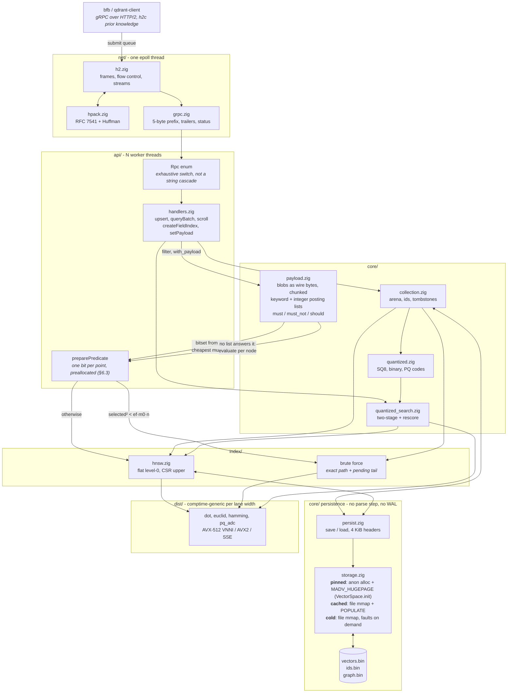
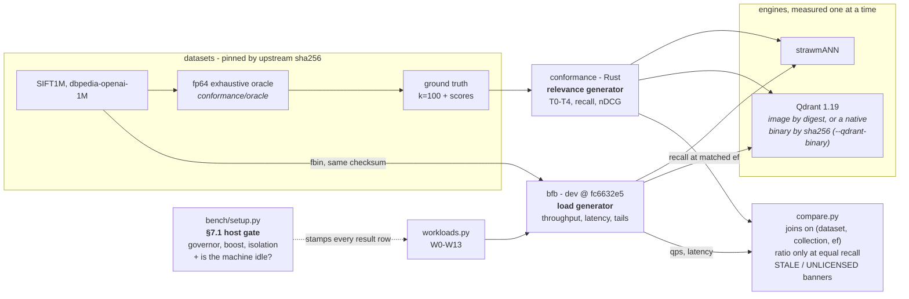

<p align="center">
  <picture>
    <source media="(prefers-color-scheme: dark)" srcset="assets/strawmann-logo-dark.svg">
    
  </picture>
</p>

<h1 align="center">strawm<em>ANN</em></h1>

<p align="center">
  <strong>A deliberately unfair strawman for approximate nearest neighbour search</strong><br>
  A Qdrant-wire-compatible vector engine in Zig, built as a <em>performance oracle</em>: no compatibility debt, no distribution, no product concerns.
</p>

<p align="center">
  <a href="https://ziglang.org/download/"></a>
  <a href="docs/comparison-sift1m.md"></a>
  <a href="docs/comparison-sift1m.md"></a>
  
  
</p>

<p align="center">
  <a href="#quick-start">Quick start</a> ·
  <a href="#how-it-works">How it works</a> ·
  <a href="#the-comparison">Comparison</a> ·
  <a href="#what-it-does-not-protect-you-from">Not protected</a> ·
  <a href="docs/findings.md">Findings</a> ·
  <a href="docs/validation.md">Validation status</a>
</p>

<!-- BEGIN compare-table (generated by bench/harness/compare.py --write-readme) -->
```
                            strawmann      qdrant 1.19      ratio
  search, one at a time         1,748            1,936      0.90x
  saturating                   23,477           10,501      2.24x
  mixed read/write              1,817            1,870          -
  exact                           191              145      1.31x
                                                       queries/second

  sift1m, d=128, euclid — these ratios are this dimension's. Also measured: dbpedia-openai-100K-1536-angular

  at equal recall (§7.4's comparison, not equal ef): 2.17x at recall 0.9877, falling to 1.69x at 0.9984, over 8 anchors

  saturating: [2.24x is 1.57x less work per query x 1.37x cores busy during the row (7.53 against 5.48) x 1.04x clock: the middle term is occupancy, not search speed]
  mixed read/write: [strawmann: search covered 45% of the append; append 3,300 points/s] [qdrant: search covered 44% of the append; append 3,300 points/s] [search-during-write; no recall join]
  exact: [1.31x is 0.77x less work per query x 1.70x cores busy during the row (6.94 against 4.09) x 1.00x clock: the middle term is occupancy, not search speed]
```
<!-- END compare-table -->

<p align="center">
  <em>SIFT1M, both engines measured alone on the same host, in the
  <code>as-deployed</code> profile. Every figure is the median of three passes
  per engine, alternated A/B/A/B. The run's gate verdict, conformance tier and
  hashes are printed under the full table in
  <a href="docs/comparison-sift1m.md">docs/comparison-sift1m.md</a>, which is
  generated with it rather than transcribed after it. The whole run is also one
  self-contained HTML page under
  <a href="https://agourlay.github.io/strawmann/reports/">rendered at
  agourlay.github.io/strawmann/reports/</a> and kept in
  <a href="docs/reports/">docs/reports/</a>; each page needs no network.
  <a href="docs/validation.md">One machine, one day</a>: not replicated across
  hosts or repeated on another date.</em>
</p>

The deliverable is not the binary. It is a set of validated cost models and the
ratio *measured / modelled* for each. [`docs/cost-model.md`](docs/cost-model.md)
and [`docs/isa-matrix.md`](docs/isa-matrix.md) are the output, and the useful
part of both is where the model was wrong.

Everything mechanical stays `strawmann`: binary, package, flags, env vars.

Two disclosures. The author works at Qdrant, on the engine being measured: that
is the conflict of interest, and also why
[`docs/validation.md`](docs/validation.md) can answer questions by reading
Qdrant's source rather than guessing at it. Nothing here is a Qdrant position
and nobody at Qdrant has reviewed it.

And most of this was written with Claude: the harness, the analysis, these
documents. [`bench/harness/nightrun.py`](bench/harness/nightrun.py) runs a
headless `claude -p` to draft each night's write-up. The numbers themselves come
from the gate and the load generator either way.

This tree was squashed to a single commit. The pages under
[`docs/reports/`](docs/reports/) print a short hash as their build stamp, and
`docs/` cites commits by author date and subject. Both name commits from a
history this repository no longer carries. They date what produced a number;
they do not resolve here.

---

## Quick start

Requires Zig **0.16.0**. `build.zig.zon` sets the floor and CI installs exactly
that (§9: "a benchmark that silently changes compiler is not a benchmark").

```sh
scripts/doctor.py       # is this machine set up, what can it measure, where does it write?
scripts/check.py        # the gate: format, lint, tests, both languages
zig build -Doptimize=ReleaseFast   # §9: numbers are only ever quoted from this
./zig-out/bin/strawmann --port 6334  # the banner states build mode and ISA
```

`strawmann --help` lists the flags; the ones that size the server are
`--io-threads`, `--workers`, `--connections` per I/O thread, `--streams` per
connection and `--capacity` per collection. Every driver is Python: the analysis
tooling is a uv project under `bench/`, while the gate and the dataset fetcher
are stdlib-only so they run on a fresh clone.

**The whole benchmark is one command**, because a sequence held in someone's
head is how the two arms of a published comparison once ended up under
different environment hashes:

```sh
bench/harness/fullrun.py --server-cpus 4-11 --client-cpus 0-3
bench/harness/fullrun.py --server-cpus 4-11 --client-cpus 0-3 --reps 3 --perf
bench/harness/smoke-test.sh            # sift1m, one pass per engine, ~35 min
```

`fullrun.py` runs the §7.1 gate, builds ReleaseFast, walks W0-W13 against
strawmANN pinned to the server cores with the load generator on the complement,
sweeps recall while the collections still match the ground truth, runs the
mutating rows last, then repeats the lot against Qdrant **on the same cores**,
runs the §8 differ with both engines up, and records, renders and regenerates
the tables in this file. `--skip build|strawmann|qdrant|conformance|render`
runs part of it; `--lax` proceeds on a host that failed the gate and stamps
every row unpublishable. `--dataset` picks the corpus every row, both sweeps
and the differ read. Its metric and width come from `datasets.json`, so a
collection cannot be created under one geometry and scored against ground truth
computed under another. Two labels that ran different datasets are not
ratioable, and `compare.py` refuses the pair rather than dividing one corpus's
throughput by another's.

`smoke-test.sh` is the fixed thing to run after a change: one pass per engine
into labels that are not the published ones, keeping the differ, because a
faster run that stops noticing strawmANN return the wrong ids is not a smoke
test. One pass forfeits two things and the report says both: §7.2(5) wants
A/B/A/B and gets A-then-B, and no noise floor is folded below three passes, so
no ratio on its page is banded. Hardware counters need a native Qdrant
(`perf_event_open` cannot attach into the container) and cost a measured 4.25%,
which is why `--perf` is opt-in everywhere a number is banded.
[`docs/workloads.md`](docs/workloads.md) has the rows; the flags each of these
scripts fixes, and why, are in their own `--help`.

**Nothing is written outside the checkout except under one cache root**, defined
in `bench/harness/paths.py` and read by every driver, so there is one place to
move it and no reason for a storage directory to appear in `$HOME`:

```sh
$STRAWMANN_CACHE          # default ${XDG_CACHE_HOME:-~/.cache}/strawmann
  datasets/               # $STRAWMANN_DATA: ~21 GB with both §4.2 tiers converted
  qdrant-storage/         # $QDRANT_STORAGE: the comparison target's volume
bench/results/            # in the checkout, gitignored: results belong to the
                          # tree that produced them, not to the user's cache
```

Four sources decide each root, highest first: `--data-dir` (this run), those
variables (this shell), `${XDG_CONFIG_HOME:-~/.config}/strawmann/config.toml`
(this user), the layout above (always). A malformed config file is refused
rather than ignored, and `scripts/doctor.py` prints which of the four each root
came from. `--data-dir` exports `$STRAWMANN_DATA` for the tools it spawns, so a
dataset directory can live on another disk or be *shared* with bfb and
vector-db-benchmark rather than fetched twice.

The pieces also run on their own:

```sh
bench/setup.py check                                             # §7.1 host gate
conformance/datasets/datasets.py fetch                           # fetch + verify
bench/harness/workloads.py run http://localhost:6334 strawmann    # W0-W13
bench/harness/compare.py strawmann qdrant                        # join two runs
bench/harness/isa_sweep.py run --reps 3                          # §7.5 ISA matrix
uv run --project bench bench/harness/report.py strawmann qdrant  # the HTML page
zig build bench                  # §7.2 hardware baseline + kernel matrix
cd conformance && cargo test     # 172 tests: oracle, differ tiers, metrics
```

## How it works



The I/O thread never blocks and never allocates, and workers own their scratch,
so no two concurrent queries share state. §6.3 forbids allocation on the query
path, so every buffer is sized at startup.

Search reads a graph published with release ordering while ingest holds a write
lock, so writes never block reads. Points appended since the last build are not
in the graph, so `search` scans that tail exhaustively and merges. That is what
keeps a write from collapsing read performance.

A filter is turned into a predicate before the search starts, never applied to
the results afterwards. `payload.Store.select` walks the *cheapest* `must`
condition's posting lists into a preallocated bitset, one bit per point, and
hands the index a predicate that is a bit test. A filter no posting list can answer gets
no bitset and is evaluated against the stored blobs per node instead, which is
the cost `docs/spec.md` records for an unindexed filter.

Having the exact matching count is what decides the path. Scoring the matching
set directly costs `selected`; traversing under the predicate costs about
`(ef / selectivity) · m0`, so plain wins exactly when `selected² < ef·m0·n`.
At n=200,000, ef=128 and m0=32 the crossover is a matching set of 28,621. That
comparison replaced one against `full_scan_threshold`, which is a statement
about *unfiltered* scans and said nothing about when a filtered traversal stops
working: a 200-of-200,000 keyword filter traversed the whole graph at 4.5 qps
where a full fp32 scan of five times the data runs at 192.

Persistence is designed but not wired: §6.4 makes the on-disk layout the
in-memory layout, so recovery would be `open` plus `pread` with no parse step,
and `persist.save`/`load` implement exactly that, but no RPC, flag or shutdown
hook reaches them, and `load` refuses a mapped placement rather than guess
whether the caller meant a snapshot directory or a live mapped arena. The live
arena is anonymous memory under the default `pinned` placement and a file
mapping under `cached` or `cold`, which is how the server honours
`VectorParams.memory` (see *Where the vectors live*). Mapped placements are
pinned to 4 KiB pages on purpose: §5.5's reasoning is that huge pages on a
file-backed mapping are kernel-dependent and cannot be assumed.

---

## The comparison

Both engines measured **alone**, same frozen script, same dataset, every row
recording its own load, on a box that passes §7.1 in the `as-deployed` profile:
governor, boost and SMT set, the scheduler left as it ships, quiescence checked
per arm.

The four rows above the fold are the summary; the full W0-W13 table is in
[`docs/comparison-sift1m.md`](docs/comparison-sift1m.md), and each dataset gets
its own such document because two datasets are not ratioable. The rendered page
for each run is at
[agourlay.github.io/strawmann/reports/](https://agourlay.github.io/strawmann/reports/).

**What a licensed run supports, and what it does not.** Four things narrow what
the table means, whichever run produced it:

- **Only the search rows carry a noise floor.** At `--reps 3` every row with a
  qps gets one from its own three passes (25 of 32 on sift1m) and the report
  marks a ratio inside its band *inconclusive* rather than leaving the reader to
  apply the threshold. The seven ingest and index-build rows get none, so no
  build time carries a verdict, and a floor from three samples is itself noisy:
  one unlucky pass widens a band much further than it moves a median
  ([`validation.md`](docs/validation.md)).
- **W11 measures the rebuild window, not search-during-write.** Appending 200k
  crosses `rebuild_ratio`, the graph is dropped for queries until the rebuild
  publishes, and the row spends most of its time brute-forcing the collection
  (findings 25). Its ratio is refused, and the row reports the write overlap it
  achieved.
- **Both arms are held at one residency, and it is not strawmANN's default.** A
  ratio across two residencies measures the residency, and `cached` is the only
  one both can serve: v1.19.0 answers `pinned` with *not supported for dense
  vector storage*. So the table does not say what a strawmANN user gets out of
  the box; `--placement pinned --skip qdrant` measures that separately, and the
  difference bounds the confound.
- **The gate verdict is per row, and an arm can be half-gated.** `workloads.py`
  re-checks §7.1 per invocation, so `compare.gate_of` reports `mixed` when the
  rows disagree and `fullrun` refuses to splice a table containing any row
  stamped `FAIL`. That refusal exists because a run got past it once: a SIFT1M
  table published here in August came from a Qdrant arm with 25 of its 26 rows
  stamped `FAIL`. The table above the fold is `pass` on all 32 rows of both
  arms.

Units are **queries** per second throughout. bfb's `rps` counts batch
*requests*, which once made W5 read as a 7x regression when it is faster. The
ratio is not repeated here, because a hand-written copy of a measured number is
what `readme-table-current` exists to stop.

## How the benchmark is wired



**bfb generates load, [`conformance/`](conformance/README.md) generates
relevance, and neither reports the other's numbers**: §4.1's rule, not a style
choice. bfb can measure recall on `dev`, but as a strict id-set intersection
with no tie handling, scored against whatever ground truth the dataset shipped;
§8.6 needs ε-aware recall against our fp64 oracle, and on SIFT1M 54% of queries
return the same neighbours in a different order, so the two disagree exactly
where ties are common.

W10 is where they meet: bfb sweeps `ef` and reports latency, the harness reports
recall at the same `ef`, and `compare.py` joins the series on (dataset,
collection, `ef`). It prints a ratio for a search row **only when both engines'
recall@10 at that row's `ef` is known and within 0.01**, never for the open-loop
rows where the figure is an offered rate rather than a speed, and it refuses the
whole table, **STALE**, when the two result sets did not come from the same
harness configuration, or **NOT A LICENSED COMPARATIVE CLAIM** unless the
differ's row sets `licenses_comparative` (§8.5 T3). Whether the published tables
are in that state is a gate step rather than an assertion:
`compare.py --check-readme` verifies both arms' stamps and the differ row, and
prints the hash it verified against.

`conformance/` is what decides whether any of this may be published. It links
the same pinned `qdrant-client` as bfb, so a divergence it sees is server-side
rather than an artefact of how the harness talks to each engine; it runs the
fp64 oracle (neither engine is ground truth), the T0-T4 tiers, and an ε
calibrated from Qdrant's own cross-ISA spread rather than chosen. §8's rule is
that no performance number is publishable without a green conformance row for
the same build on the same data, and the results sink enforces it by refusing
rows whose hash it has never seen. See
[`conformance/README.md`](conformance/README.md).

### The HTML report

```sh
uv run --project bench bench/harness/report.py strawmann qdrant --open
```

One self-contained file per run:
`bench/results/report-<dataset>-<a>-vs-<b>-<day>-<hhmm>.html`, keyed by corpus,
arms and minute so a second run cannot replace the first. Plotly is embedded, so
it opens with no network and still renders six months later from an email
attachment. It is written to be read by someone who did not run it: the §7.1
gate verbatim, the build and binary hashes, throughput with any ratio inside the
noise floor marked *inconclusive*, latency labelled open or closed loop, recall
against the fp64 oracle with the matched-recall frontier, storage and I/O, the
scheduler and stall counters, and per-row ambient load. It refuses rather than
estimates: contamination that arrived mid-table, a row one engine declined, a
ratio with no floor, a storage figure from two different placements. Reading the
rendered page is how several rows describing themselves as the opposite of what
they measured were caught.

**The published runs are browsable at
[agourlay.github.io/strawmann/reports/](https://agourlay.github.io/strawmann/reports/).**
GitHub Pages serves [`docs/reports/`](docs/reports/) directly, with Jekyll
disabled, so the page you open is the same file this repository commits rather
than a re-rendering of it. The blob view will not display them, since each is
about 5 MB.

That index says what each run is and which of them the front page quotes. It
also says why they are not a series: between two of them the bfb pin moved, W12
became two rows on a differently uploaded collection, W11's append became
throttled, and Qdrant was rebuilt twice, so `compare.py` refuses ratios across
them as STALE. Read each page against itself, starting with the licence header
it carries.

---

## Where the vectors live

Qdrant's `VectorParams.memory` has three values and strawmANN honours all three
for the vector arena. The names are Qdrant's, because the point of the setting
is to put both engines in the same one.

| placement | what it is | strawmANN | Qdrant |
|---|---|---|---|
| `Pinned` | in RAM, never evicted | anonymous memory, `MADV_HUGEPAGE` for 2 MiB pages | **not supported for dense vectors** |
| `Cached` | mmap, prefaulted at open, evictable | file-backed `MAP_SHARED` + `MAP_POPULATE`, 4 KiB pages | the default |
| `Cold` | mmap, faulted in on demand | the same mapping without `MAP_POPULATE`, `MADV_RANDOM` | what `on_disk: true` selects |

```bash
strawmann --data-dir /var/lib/... --default-placement cached   # match qdrant's default
```

Three things to know before quoting a number from any of it. **The defaults
differ deliberately**: an unconfigured collection is `Pinned` here and `Cached`
on Qdrant, so an unconfigured run compares two residencies; `--default-placement`
closes that for a run rather than only describing it. **A cold collection is not
cold after you upload to it**, because ingest writes through the page cache: a
freshly written 8 MiB arena reports 2048/2048 pages resident under `Cold`, and
0/2048 only after `fsync` + `fadvise(DONTNEED)`. **And a cold placement on tmpfs
is never cold**: the page cache *is* the storage there, `fadvise(DONTNEED)`
succeeds and changes nothing, so a `--data-dir` under `/tmp` silently makes the
cold arm identical to the cached one.

Only the vector arena has a placement: the graph and the quantized codes are
always pinned, and `hnsw_config.memory` is refused with `UNIMPLEMENTED` naming
the field rather than accepted and ignored. The deprecated `on_disk` bool is
honoured behind `memory` with Qdrant's precedence, where `on_disk: false` means
`Cached` and **not** `Pinned`. Reading it the other way would have strawmANN
claim it matched an in-RAM Qdrant configuration Qdrant does not offer.

## What it does not protect you from

§1's non-goals say what is *absent*, and everything in them returns
`UNIMPLEMENTED` naming the construct rather than degrading silently. This says
what is **present and unsafe**, because a missing feature announces itself and a
partial one does not. Every item was verified in the source, and each names the
file where it lives.

**Search reads rows without the write lock; a seqlock makes that safe, and it
only covers searches.** `upsert` takes `write_lock`, `search` takes none.
Appends are reserve → write → publish, so a reader's bound never admits a
half-written row; an in-place overwrite bumps a per-row version, `beginInPlace`
drains the searches already inside, and `Probe.scoreNode` re-reads a row whose
version moved. Both are tested. What is *not* covered: the builder threads hold
no `SearchGuard`, so that drain does not wait for them and the first overwrite
in a collection's life can tear a row under a builder. That torn score is
tolerated rather than guarded: the row is on `overwrite_log`, so the published
graph counts it as pending and re-encodes the codes from the arena at publish,
which is the state a post-publish overwrite already leaves. One graph edge can
be built from a torn read; no result can.

**Nothing is durable, and nothing is written deliberately.** No WAL, no
fsync, no recovery: the server never calls `persist`. Under the default
`pinned` placement the arena is anonymous memory populated by `pread`; under
`cached`/`cold` it is a `MAP_SHARED` file mapping. The ids, tombstones and
graph are anonymous either way, so a restart loses the collection whatever the
placement. Bytes do still reach the block layer under `cached`, which is what
every published run uses (the arena's dirty pages are written back, gigabytes
over a full W0-W13 run) and the *Storage and I/O* table in
[`docs/comparison-sift1m.md`](docs/comparison-sift1m.md) prints the total
beside Qdrant's. §6.4's save and load exist and are tested; nothing reaches
them, `load` refuses a mapped placement and `save` refuses a quantized
collection.

**Deletes never reclaim anything.** A tombstone bit, and that is all: the row
keeps its space, the point keeps its place in the graph and is filtered only as
results are admitted, and it still counts against capacity. Space comes back
when the whole collection is dropped.

**Capacity is fixed at startup and shared by every collection.** `--capacity`
(default 1,100,000) is a server-wide number applied to each collection created,
and the wire has no field to override it. Exceeding it fails the upsert with
`RESOURCE_EXHAUSTED`; the arena never grows. Ten collections preallocate ten
times the memory: a full W0-W13 run creates seven, and the dbpedia-openai-100K
comparison peaks at 4.8 GiB of RSS.

**A rebuild doubles the graph's memory.** The old graph keeps serving while the
new one is built, each sized to *capacity* rather than to the point count.

**`uint8` storage silently mangles fp32 data.** Components convert the way
Rust's `x as u8` does, which is what Qdrant relies on: saturating outside
[0, 255], truncating toward zero inside it, NaN to 0. So 300 stores as 255, −5
as 0, and 2.9 as 2. A client that sends fp32 data into a `uint8` collection
gets a mangled vector and an OK response. Matched deliberately
(`dist/datatype.zig`); being stricter would be a conformance failure rather
than an improvement.

**`hnsw_ef` is honoured to 4,096 and silently clamped above that.** §6.3
forbids allocating on the query path, so the frontier and result heaps are
sized once at startup, at `Workspace.max_ef` (`api/handlers.zig`); a larger
`ef` is reduced to it rather than refused. No sweep published here goes past
512, so nothing measured was clamped.

**Scroll pagination is not stable across writes.** The id ordering is built
once and cached, and any upsert or delete drops it; a client paging through a
collection that is being written may see a page boundary move under it.

**There is no authentication, no TLS, and no request quota** beyond fixed
buffer sizes. It binds a port and trusts whatever connects. Do not put it on a
network you do not control.

**Two engines on one host will not be stopped.** The harness warns when it sees
both, and the server itself does not care: nothing prevents a measurement being
taken while something else is competing for the memory bus.

---

## Layout

```
src/
  dist/     SIMD kernels, comptime-generic per lane width, + cpuid dispatch
  proto/    hand-written protobuf codecs (no codegen, no reflection)
  net/      epoll loop, HTTP/2 + HPACK, gRPC framing, fuzzers
  api/      RPC handlers, end-to-end tests over a real socket
  core/     collection, ids, arenas, quantized store, storage, payload + filters
  index/    hnsw build/search, brute force, visited set, heaps
  quant/    sq8, binary, pq, codebook training
bench/
  micro/    bandwidth, latency, MLP, TLB, kernel matrix, perf counters
  isa/      forced-ISA asm probe, dump_asm.py (docs/asm/ regeneration + --check)
  harness/  workloads.py (§4's table), compare.py, recall.py, fullrun.py,
            smoke-test.sh (what "smoke test" means here, fixed),
            isa_sweep.py, provenance.py, aggregate.py, ...
            procstat.py (/proc + cgroup per row), perfstat.py (perf stat)
            report.py + report_data.py (the Run, the loading, the analysis)
            + report_charts.py (the figures), layered in that order
  setup.py  §7.1 environment gate
conformance/  Rust, uses qdrant-client: one client, both engines (README.md)
  src/oracle/      fp64 exhaustive reference + ground-truth cache
  src/differ/      T0-T4 tiers, tolerance calibration
  src/relevance/   recall@k, MRDE, Wilson intervals (nDCG needs qrels: unrun)
  src/metamorphic/ oracle-free invariants
  src/datasets/    fbin/fvecs/parquet readers
  datasets/        datasets.json + datasets.py: fetch, verify, convert (§4.2)
scripts/      check.py (the gate), doctor.py
docs/asm/     disassembly per ISA arm, regenerated by dump_asm.py
```

### Documents

| | |
|---|---|
| [`spec.md`](docs/spec.md) | the specification everything is measured against |
| [`findings.md`](docs/findings.md) | what the measurements showed, including the inverted predictions |
| [`validation.md`](docs/validation.md) | what has been checked, what has not, and what would close the gap |
| [`decisions.md`](docs/decisions.md) | the engineering decision log, including the wrong calls |
| [`comparison-sift1m.md`](docs/comparison-sift1m.md) | the full W0-W13 table for SIFT1M, generated with the run, and its caveats |
| [`comparison-dbpedia-openai-1m.md`](docs/comparison-dbpedia-openai-1m.md) | the same at d=1536, 1M, the headline tier: licensed on 2026-09-24, and its caveats |
| [`comparison-dbpedia-openai-100K-1536-angular.md`](docs/comparison-dbpedia-openai-100K-1536-angular.md) | the same at d=1536, 100K, measured once on 2026-08-26 |
| [`reports/`](https://agourlay.github.io/strawmann/reports/) | the rendered HTML page for each published run, served over Pages: throughput, latency, recall, counters, host discipline, self-contained |
| [`cost-model.md`](docs/cost-model.md) | the measured constants, and where the model was wrong |
| [`datasets.md`](docs/datasets.md) | the descriptor, what is pinned, and how to add a dataset |
| [`ground-truth.md`](docs/ground-truth.md) | M-1: published vs recomputed GT |
| [`workloads.md`](docs/workloads.md) | W0-W13 derived against the pinned bfb `dev` |
| [`dataset-runs.md`](docs/dataset-runs.md) | both tiers end to end: recall curves, scroll walk |
| [`isa-matrix.md`](docs/isa-matrix.md) | §7.5, and §6.6.1's prediction under test |
| [`kernel-matrix-*.md`](docs/kernel-matrix-native.md) | per-cell `zig build bench` dumps per ISA arm, which §7.5's frequency guard rail cites; development-grade and not re-measured since the harness fixes in `cost-model.md` |
| [`tolerance.md`](docs/tolerance.md) | §8.4's calibrated ε, and the spreads each was derived from |
| [`conformance/README.md`](conformance/README.md) | the correctness gate: the three claims, T0-T4, and why it is a separate Rust binary |

---

## Licence

Apache 2.0. [`LICENSE`](LICENSE), copyright in [`NOTICE`](NOTICE).

The engine links no third-party code. The pages under `docs/reports/` inline
their JavaScript so they open with no network, so each embeds a copy of
Plotly.js under its own MIT licence, with its notices inside the file.
